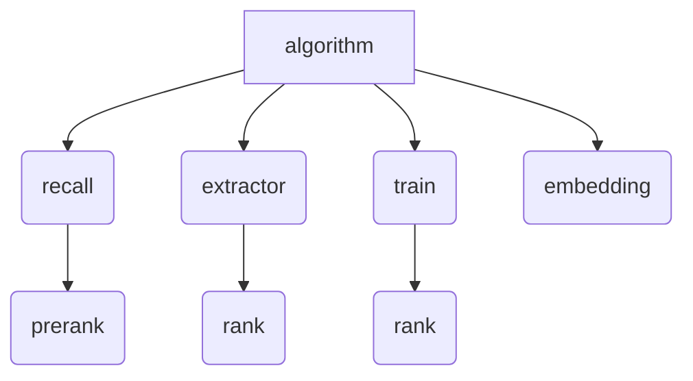

# R4
bytetrade recommend algorithm   

# Recommended data generation 
```
recall->prerank->crawler->extractor->rank

```

- Racall gets the packet from juicefs, generates recall results, and stores them in nfs.
- Prerank gets the recall results from nfs, generates prerank results, and stores them in mongo through knowledge.
- Crawler is the system workflow,it gets the entris that have not been crawled in the recommended data, and crawls the raw content according to the URL and saves it.
- Extractor gets entries that have been crawled but not yet extracted, and then stores them after extracting them.
- Finally, rank generates refined ranking results.
- So we need to implement recall,prerank, extractor, and rank modules.
- We alse need train module to get the rank model and user-embedding module to update user embedding timely.

# Algorithm workflows in Argo  

- recall and prerank workflow generates prerank results and schedules them in 10 minutes.
- The extractor and rank workflow generates rank results. 
    If last_extractor_time>last_crawler_time the extractor task will not be executed
    if last_rank_time>last_extractor_time the rank task will not be executed
- The train workflow generates a new rank model, and then executes the rank task based on the latest model to generate rank results.
- The embedding workflow updates the user embedding value.

# Table of Contents
- [prerank-stages](#prerank-stages)
- [train-rank](#train-rank)
- [user-embedding](#user-embedding)

# Main Environment Variables
| Parameter                            | describe                                                   |
|--------------------------------------|------------------------------------------------------------|
| NFS_ROOT_DIRECTORY                   | nfs directory，save recall and prerank results             |
| JUICEFS_ROOT_DIRECTOR                | juicefs directory，save feed and entry datas from cloud    |
| TERMINUS_RECOMMEND_SOURCE_NAME       | source name,identify the algorithm                         |
| KNOWLEDGE_BASE_API_URL               | knowledge api address                                      |
| SYNC_PROVIDER                        | cloud data provider                                        |
| SYNC_FEED_NAME                       | cloud data feed name                                       |
| SYNC_MODEL_NAME                      | cloud entry data model name                                |

The system module sync pulls package datas from the cloud, the data sources are configured in the market.
```
options:
  syncProvider:
  - provider: bytetrade
    feedName: news
    feedProvider: 
      url: https://recommend-provider-prd.bttcdn.com/api/provider/feeds?name=feed_base
    entryProvider: 
      syncDate: 15
      url: https://recommend-provider-prd.bttcdn.com/api/provider/entries?language=zh-cn&model_name=bert_v2
  - provider: bytetrade
    feedName: tech
    feedProvider: 
      url: https://recommend-provider-prd.bttcdn.com/api/provider/feeds?name=feed_base
    entryProvider: 
      syncDate: 15
      url: https://recommend-provider-prd.bttcdn.com/api/provider/entries?language=zh-cn&model_name=bert_v2
```
In this configuration, the algorithm can use news and tech data source.
Packages are stored in juicefs, the news stored directory are as follows
- feeds data: JUICEFS_ROOT_DIRECTOR/feed/bytetrade/news
- entries data: JUICEFS_ROOT_DIRECTOR/entry/bytetrade/news/{model_name}


# Prerank Stages
This part of the code includes recall, prerank and extractor modules.

run detail [here](prerank-stages/README.md)

## Directory structure
```
system workflow
|-- api                  # knowledge api     
|-- common               
|-- config               # algorithm config 
|-- extractor            # extractor module
|-- model                #
|-- prerank              # prerank module
|-- protobuf_entity      # protobuf data format   
|-- recall               # recall module

```

## recall
```
1. Get parameters user_embedding ,last_recall_time from knowledge.
2. Get the incremental entry data in juicefs and last recall result in nfs.
3. Generate recall result and save the data in nfs.
4. Set last_recall_time through knowledge.
```

## prerank
```
1. Get parameters user_embedding   from knowledge.
2. Get recall result from nfs.
3. Generate prerank result and save data through knowledge.
    - Get the data that this algorithm has produced.
    - If the new data does not exist before, add recommended data through knowledge.
    - If the previous data is not in the current prerank result, delete the data through knowledge.
```

## extractor
```
1. Get the entry list(crawler=true、extract=false) through knowledge.
2. For each entry, parse the text content based on raw content.
3. Batch update the entry data through knowledge.
```

# train-rank
This part of the code is about the rank operation of the process and the training of the rank model.

more detail [here](train-rank/README.md)


# user-embedding
This part is about the calculation of userembedding. The general principle is to calculate a temporary user vector based on the articles the user has read in the past period. Add this temporary user vector to the old user vector to get a new user vector.

more detail [here](user-embedding/README.md)

