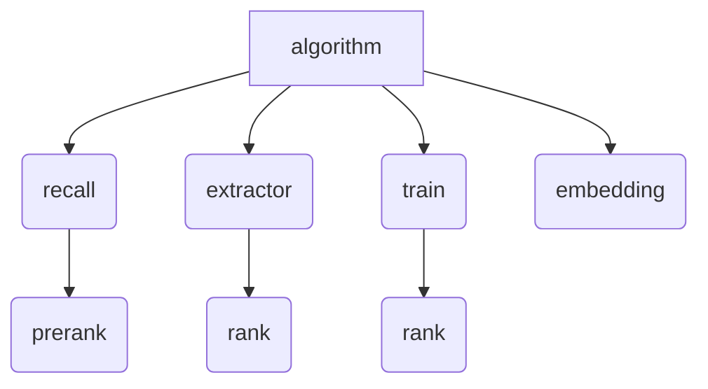

# R4


**R4** is a family of decentralized recommendation algorithms offered by Terminus. It provides recommendations for various topics including world news, sports headlines, business reports, and so on.

The name R4 is inspired by Obi-Wan’s intelligent and trustworthy droid from the Star Wars series.

> He was a cunning warrior and a good friend <br>
> \- Obi-Wan Kenobi

## Key Features
**Security and Privacy First**<br>
R4 operates in an offline sandbox on Terminus Edge, ensuring no data is sent to third-party servers. All user's personal data will be encrypted and stored locally.

**Personalized Content Curation**<br>
R4 uses user behavioral data, such as reading, liking, and bookmarking, to create a dynamic user profile. It automatically updates recommendations in response to changes in user behavior and global trends.

**Lightweight Design**<br>
R4 employs a classical recommendation process to achieve better results with minimal resources. It includes crucial steps like recall, pre-rank, and rank. It also utilizes the embedding results from content providers to conserve computational resources.

## Recommendation Pipline in General
R4 employs a classic recommendation process, illustrated as follows:
```
recall->prerank->crawler->extractor->rank
```
- **Recall** retrieves the packet from JuiceFS and removes irrelevant content, leaving approximately 10,000 articles for further sorting. The recall result is then stored in NFS.
- **Prerank** get the recall results from NFS, sorts the retrieved content, and stores prerank results in MongoDB using `knowledge`.

- **Crawler** is a system process. It finds entries in the prerank result that haven't been crawled yet, then uses the URL to fetch the raw content and save it.

- **Extractor** eliminates clutter on a webpage, such as buttons, ads, background images, and videos, from the raw content fetched by the Crawler. It then saves this cleaned data to the `knowledge`.

- **Rank** fine-tunes the order of content based on the extracted full-text, suggesting the content that best aligns with the user's current interests.

There will be an additional process to ensure the ranking model and user-embedding module are updated promptly.

## Main Environment Variables
| Parameter                            | describe                                                   |
|--------------------------------------|------------------------------------------------------------|
| NFS_ROOT_DIRECTORY                   | nfs directory，save recall and prerank results             |
| JUICEFS_ROOT_DIRECTOR                | juicefs directory，save feed and entry datas from cloud    |
| TERMINUS_RECOMMEND_SOURCE_NAME       | source name,identify the algorithm                         |
| KNOWLEDGE_BASE_API_URL               | knowledge api address                                      |
| SYNC_PROVIDER                        | cloud data provider                                        |
| SYNC_FEED_NAME                       | cloud data feed name                                       |
| SYNC_MODEL_NAME                      | cloud entry data model name                                |

The system module sync retrieves content index packets from the cloud. The data sources are configured in the Market, for example.
```
options:
  syncProvider:
  - provider: bytetrade
    feedName: news
    feedProvider: 
      url: https://recommend-provider-prd.bttcdn.com/api/provider/feeds?name=feed_base
    entryProvider: 
      syncDate: 15
      url: https://recommend-provider-prd.bttcdn.com/api/provider/entries?language=zh-cn&model_name=bert_v2
  - provider: bytetrade
    feedName: tech
    feedProvider: 
      url: https://recommend-provider-prd.bttcdn.com/api/provider/feeds?name=feed_base
    entryProvider: 
      syncDate: 15
      url: https://recommend-provider-prd.bttcdn.com/api/provider/entries?language=zh-cn&model_name=bert_v2
```

In this configuration, the algorithm utilizes two data sources: `news` and `tech`. These packets are stored in JuiceFS, in the following directories:
- Feed data: JUICEFS_ROOT_DIRECTORY/feed/bytetrade/news
- Entry data: JUICEFS_ROOT_DIRECTORY/entry/bytetrade/news/{model_name}

## Algorithm Workflows in Argo  

- The recall and prerank workflow generates prerank results and is scheduled to run every 10 minutes.
- The extractor and rank workflow produces rank results.
  - If the `last_extractor_time` is later than the `last_crawler_time`, the extractor task will not be executed.
  - If the `last_rank_time` is later than the `last_extractor_time`, the rank task will not be executed.
- The train workflow creates a new ranking model, and then carries out the ranking task with the latest model to produce ranking results.
- The embedding workflow updates the user's embedding value.

# Algorithm Architecture
- [prerank-stages](#prerank-stages)
- [train-rank](#train-rank)
- [user-embedding](#user-embedding)


## Prerank Stages
This part of the code includes recall, prerank and extractor modules. Details are documented [here](prerank-stages/README.md)

### Directory structure
```
system workflow
|-- api                  # knowledge api     
|-- common               
|-- config               # algorithm config 
|-- extractor            # extractor module
|-- model                #
|-- prerank              # prerank module
|-- protobuf_entity      # protobuf data format   
|-- recall               # recall module
```

### recall
```
1. Get parameters user_embedding ,last_recall_time from knowledge.
2. Get the incremental entry data in juicefs and last recall result in nfs.
3. Generate recall result and save the data in nfs.
4. Set last_recall_time through knowledge.
```

### prerank
```
1. Get parameters user_embedding   from knowledge.
2. Get recall result from nfs.
3. Generate prerank result and save data through knowledge.
    - Get the data that this algorithm has produced.
    - If the new data does not exist before, add recommended data through knowledge.
    - If the previous data is not in the current prerank result, delete the data through knowledge.
```

### extractor
```
1. Get the entry list(crawler=true、extract=false) through knowledge.
2. For each entry, parse the text content based on raw content.
3. Batch update the entry data through knowledge.
```

## train-rank
This part of the code is about the rank operation of the process and the training of the rank model.

More details [here](train-rank/README.md)


## user-embedding
This part is about the calculation of userembedding. The general principle involves calculating a temporary user vector based on the articles a user has read recently. This temporary user vector is then added to the existing user vector to generate a new user vector.

More details [here](user-embedding/README.md)

